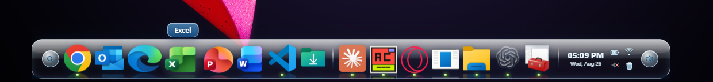
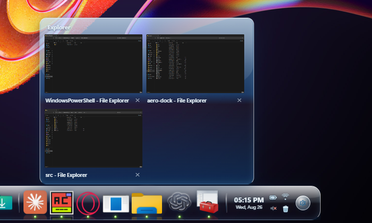
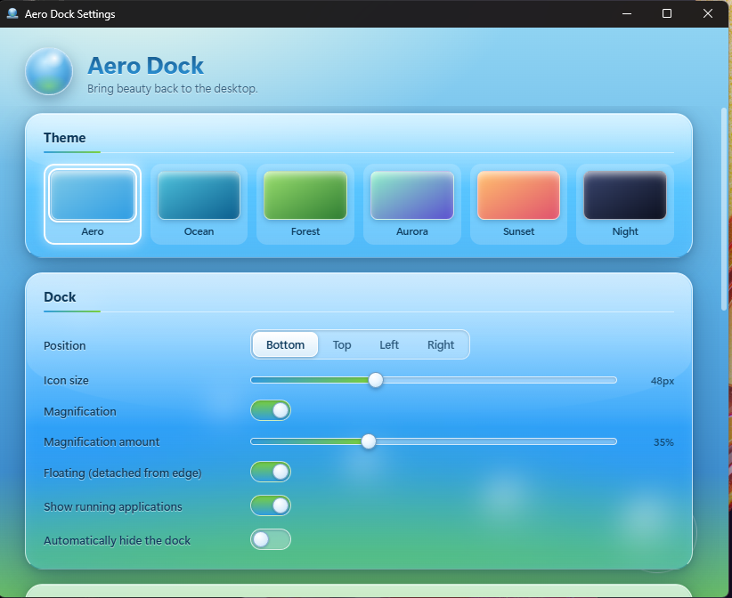

<div align="center">


# Aero Dock

**A glass dock for Windows, in the Frutiger Aero design language.**

Pin your apps to a floating pane of glass. Icons swell under the cursor, live
window previews rise on hover, and light moves across everything — as if
Vista's aesthetic had never stopped evolving.

[](https://github.com/TheAgencyMGE/aero-dock/releases/latest)
[](https://github.com/TheAgencyMGE/aero-dock/actions/workflows/ci.yml)
[](LICENSE)
[](#requirements)



</div>

---

## What it is

Aero Dock is a desktop dock and app launcher for Windows 10 and 11. It sits on
any screen edge and gives you one place to launch apps, switch windows, and
glance at your system — the job the taskbar does, done in glass.

It is a native app, not a web wrapper pretending to be one: the entire Windows
integration layer is Rust talking directly to Win32 and COM. Shortcut
resolution, icon extraction, window tracking, and the live previews are all
real Windows APIs. The interface on top is React, rendered in WebView2, which
is what makes the glass look like glass.

## Why you might want it

- **Because Windows docks mostly look like macOS docks.** This one doesn't.
  Frutiger Aero — glass, water, light, and life — is a deliberate aesthetic
  choice, not a theme bolted on afterward.
- **Because it's genuinely idle.** The WebGL ticker stops when nothing is
  animating, ambient motion pauses when you leave the dock alone, and all
  motion runs on the compositor. A dock that costs CPU while you aren't using
  it is a dock you uninstall.
- **Because it stays out of your business.** No network requests. No telemetry,
  no analytics, no crash reporting, no update check, no account. Your
  configuration is one JSON file on your own disk.
- **Because it's yours.** MIT licensed, and the whole thing is here to read.

## Features

**The dock**

- Lives on any edge — bottom, top, left, or right — floating or flush against
  it, correctly positioned per monitor at any DPI scaling
- Cursor magnification with soft spring physics, idle float, launch bounce, and
  glass tooltips
- Auto-hide with an 8px reveal strip along the edge
- A monitor picker when you have more than one display

**Apps and windows**

- Running-app indicators; click to focus, click again to cycle windows or
  minimize
- **Live window previews** — real DWM thumbnails, framed in glass, showing what
  each window is actually doing right now
- Drag to reorder pinned items; drop apps, files, or folders straight from
  Explorer to pin them
- Folder flyouts that bloom open into a grid, and **stacks** that group several
  pinned items behind a single tile
- Context menus with Open, Run as administrator, Open file location, pin/unpin,
  and per-window actions

**Search**

- Keyboard-first overlay covering installed apps — including packaged Microsoft
  Store apps — and recent files

**System corner**

- Clock and date, battery, network status, volume (scroll to adjust, click to
  mute), and the Recycle Bin (click to open, right-click to empty)

**Looks**

- Six themes: Aero, Ocean, Forest, Aurora, Sunset, and Night
- Optional wallpaper color sync that tints any theme from your desktop
  background
- Ambient scenes drifting behind the dock: dust, rain, snow, bubbles, or aurora
- Sliders for glass intensity, bloom, reflections, particle density, opacity,
  and animation speed
- Honors `prefers-reduced-motion` — decorative motion turns off

## Screenshots

<div align="center">



*Live window previews — real DWM thumbnails, not screenshots*



*Settings, in the same design language as the dock itself*

</div>

## Install

Download the installer from the
[latest release](https://github.com/TheAgencyMGE/aero-dock/releases/latest) and
run it. It installs for the current user, so it needs no administrator rights.

Aero Dock starts in your system tray. Left-click the tray icon to show or hide
the dock; right-click it for settings and quit.

> **A note on SmartScreen:** the installer isn't code-signed — certificates
> cost money this project doesn't have. Windows will show a "Windows protected
> your PC" prompt on first run. Click **More info → Run anyway**, or
> [build it yourself](#building-from-source) if you'd rather not take that on
> faith.

### Requirements

- Windows 10 version 1809 or later, or Windows 11
- WebView2 runtime — already installed on Windows 11 and current Windows 10
- x64

## Usage

| Action | How |
| ------ | --- |
| Launch an app | Click its icon |
| Focus a running app | Click it; click again to cycle its windows or minimize |
| See live window previews | Hover an app that has windows open |
| Pin something | Drag it from Explorer onto the dock |
| Reorder | Drag an icon along the dock |
| Group into a stack | Right-click an icon → **Stack with previous item** |
| Search | Click the magnifier on the dock |
| Settings | Click the gear on the dock, or right-click the tray icon |
| Show/hide the dock | Left-click the tray icon |

First launch offers to import a starter set of your installed apps, or to start
with an empty dock and let you pin things yourself.

## Configuration

Everything is in the settings window — there is no config file to hand-edit,
though you can export and import one.

Your settings live at:

```
%APPDATA%\com.aerodock.desktop\settings.json
```

Extracted app icons are cached as PNGs beside it. Deleting that folder resets
Aero Dock to a clean first launch.

## Privacy

Aero Dock makes **no network requests**. There is no telemetry, no analytics,
no crash reporting, no update check, and no account.

The only outbound action is opening a URL in your default browser, and only
when you click something that clearly does that — the GitHub button in
Settings, or the battery and network chips, which open the corresponding
Windows Settings page.

Everything Aero Dock knows about you is in that one `settings.json`.

## Building from source

You'll need Rust (stable, MSVC), Visual Studio Build Tools with the
"Desktop development with C++" workload, Node.js 22+, and pnpm 10+.

```sh
git clone https://github.com/TheAgencyMGE/aero-dock.git
cd aero-dock
pnpm install
```

Run it with hot reload:

```sh
pnpm tauri:dev
```

Build the installer:

```sh
pnpm tauri:build
```

The NSIS installer lands in `src-tauri/target/release/bundle/nsis/`.

Run the full quality gate — typecheck, clippy, Rust tests, production build:

```sh
pnpm check
```

## Contributing

Contributions are welcome. [CONTRIBUTING.md](CONTRIBUTING.md) covers the setup,
the house rules (style from tokens not hex, animate transforms only, idle must
cost nothing, no telemetry), and how the code is laid out.

[docs/ARCHITECTURE.md](docs/ARCHITECTURE.md) is the real map of the codebase —
worth reading before any non-trivial change.

A macOS or Linux backend is a genuinely well-shaped project if you're looking
for somewhere to start: the platform layer is already isolated behind
`src-tauri/src/platform/`.

## Troubleshooting

**The dock doesn't appear after install.**
Check the system tray — Aero Dock starts there. Left-click the icon to show the
dock.

**Some icons are letters instead of app icons.**
Windows couldn't extract an icon for that target, so the dock falls back to the
app's initial. This usually means the shortcut points somewhere that no longer
exists.

**Window previews are blank.**
DWM thumbnails need Desktop Window Manager composition, which is always on in
Windows 10 and 11. Some apps that render with their own compositor won't
produce a thumbnail.

**Windows from a Microsoft Store app group oddly.**
Packaged apps are all hosted by `ApplicationFrameHost.exe`, so Aero Dock
identifies them by AppUserModelID instead. This handles the common cases but
isn't perfect — see [Known limitations](#known-limitations).

**The dock is on the wrong monitor.**
Settings → Dock → Monitor. The picker appears when you have two or more
displays.

**Settings won't open.**
Quit from the tray icon and start Aero Dock again. If it persists, please
[open an issue](https://github.com/TheAgencyMGE/aero-dock/issues) with your
Windows build.

## Known limitations

- **Windows only.** The platform layer is isolated so a port is realistic, but
  no macOS or Linux backend exists yet.
- **UWP window grouping is imperfect.** Packaged apps are identified by
  AppUserModelID read from the frame window, which doesn't resolve for every
  app.
- **The installer is unsigned.** Expect a SmartScreen prompt on first run.

## Built with

[Tauri 2](https://tauri.app) · Rust with
[windows-rs](https://github.com/microsoft/windows-rs) · React 19 · TypeScript ·
Vite · [motion](https://motion.dev) · [PixiJS](https://pixijs.com) ·
[zustand](https://github.com/pmndrs/zustand)

## License

[MIT](LICENSE) © Ryan Panda
